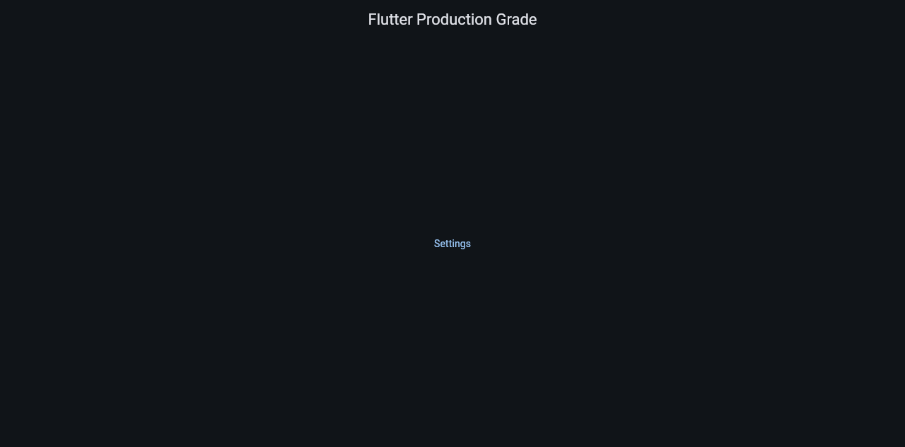

# Evidence: Flutter web build compiles and renders in a browser

Task: verify the scaffold's Flutter web target actually builds and boots, after
the docs/gitignore cleanup (commit `061285e`, on `docs/scaffold-design`).

## Command run

```
fvm flutter pub get
fvm flutter gen-l10n
fvm dart run build_runner build --delete-conflicting-outputs
fvm flutter build web --release --target=lib/main_dev.dart --dart-define-from-file=config/example.json
cd build/web && python3 -m http.server 8765
curl -s -o /dev/null -w "%{http_code}\n" http://localhost:8765/
```

## Output

```
Got dependencies!
...
Built with build_runner/aot in 7s; wrote 6 outputs.
...
✓ Built build/web
200
```

## First attempt failed silently — recorded as evidence, not omitted

The first build used the default entry point, `lib/main.dart`, which calls
`bootstrap(Flavor.prod)`. `AppConfig.validate` requires `SENTRY_DSN` to be
non-empty when `flavor.isProduction`, and `config/example.json` ships with
`"SENTRY_DSN": ""`. That throws `MissingConfigException` inside `bootstrap()`,
before `runApp()` — Flutter has no widget tree yet to show a red error screen,
so the browser tab painted a blank white page with no console error captured
by the time a devtools listener attached. This is the failure mode ADR-0017's
and the scaffold spec's "bootstrap sink" note (added in commit `747cc46`) is
about: a config failure before the app exists to report through. Confirmed by
switching the build target to `lib/main_dev.dart` (`Flavor.dev`, which does
not require `SENTRY_DSN`) — the app then rendered correctly. No code change
was made; this is expected behavior for a production flavor started without a
DSN, and it renders as a design decision, not a scaffold bug.

## Screenshots / video



`app-loads-and-navigates.webm` — 10.2s, 51KB, confirmed non-empty and playable
via `ffprobe -show_entries format=duration,size`:

```
duration=10.233000
size=52279
```

Shows the page loading from a cold navigation to `http://localhost:8765/` and
the rendered home screen with the "Settings" link visible (a subsequent click
on that link failed under headless automation — the canvas-rendered UI is not
addressable by CSS text selectors — so the recording stops after render, not
after navigation to Settings).

## Cleanup

```
kill %1   # stop `python3 -m http.server 8765` background job
rm -rf build/web
```
